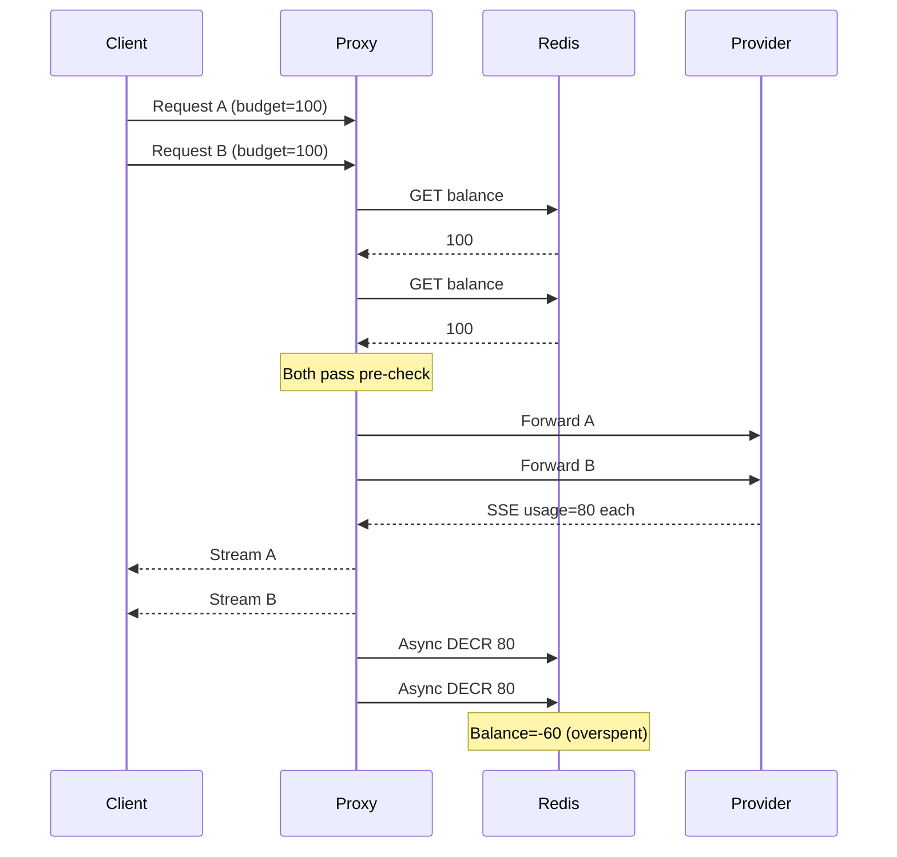
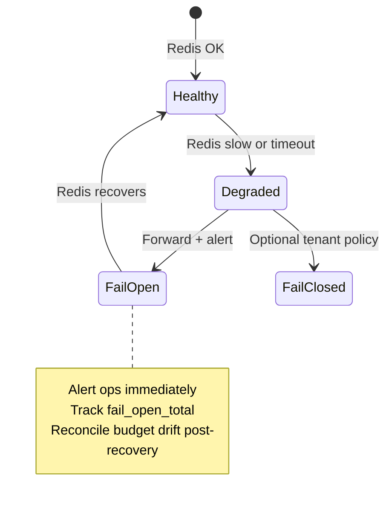
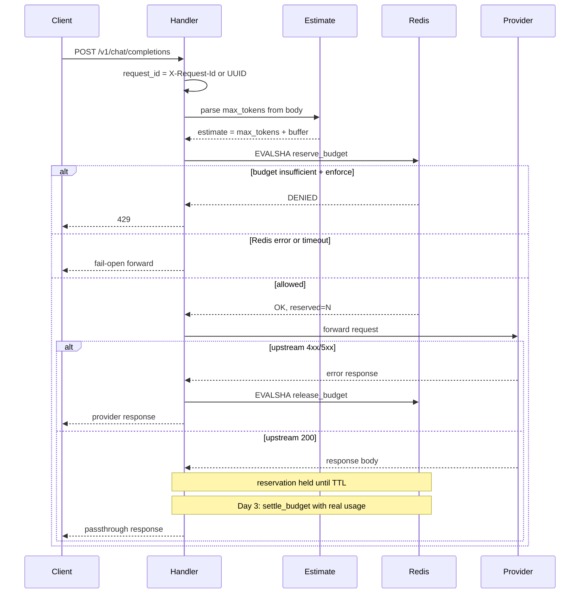
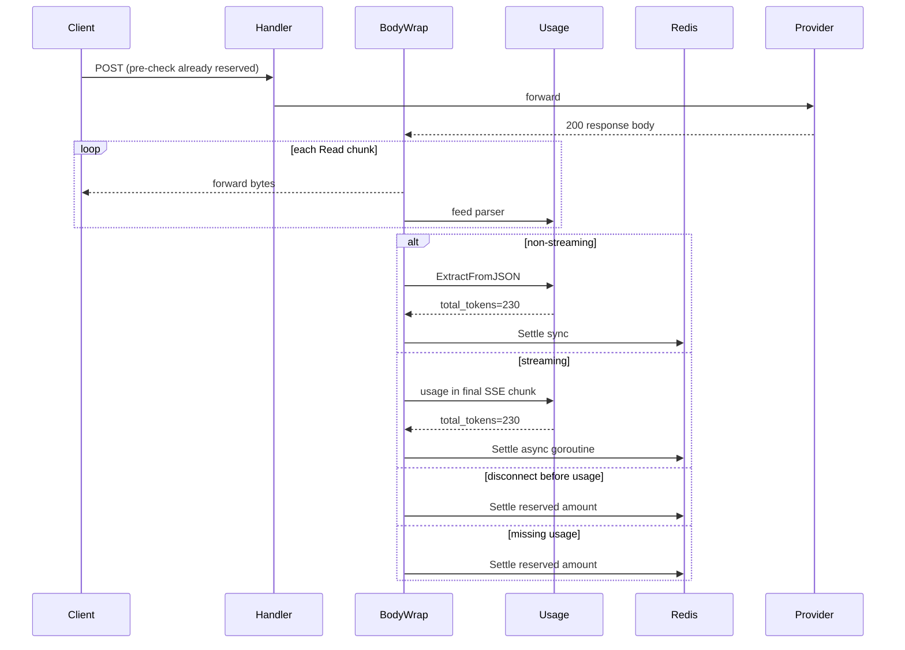

# AI Token Budgeter — Architecture

This document explains the technical **why** behind design decisions. For what to build, see [PLAN.md](PLAN.md). For implementation constraints the builder must follow, see [.cursorrules](.cursorrules).

---

## 1. System Overview

```text
Client → Proxy → [reserve_budget (Redis)] → Provider (OpenAI / Anthropic)
                      ↓ (if allowed)
              Stream passthrough → Client
                      ↓ (async)
              settle_budget (Redis) ← usage extracted from response
```

| Layer | Choice | Rationale |
|-------|--------|-----------|
| Data plane | Go reverse proxy (`net/http/httputil` + custom `ResponseWriter`/`Reader` tap) | Low latency, first-class concurrency |
| State store | Redis 7+ with Lua scripts | Atomic reservation + settlement in single round-trips |
| Upstream | Transparent pass-through to OpenAI / Anthropic HTTPS APIs | Drop-in replacement for existing clients |
| Downstream | SSE streaming passthrough (no full-body buffer) | Provider-compatible streaming without added latency |
| Alerts | Slack webhook | Minimal ops visibility for fail-open and budget events |

---

## 2. The Two-Phase Budget Bug

The original PRD described Lua scripts for atomic "check-and-decrement" but specified a flow of **check-before / decrement-after-async**. Under concurrency, this guarantees budget overspend.



**Root cause:** Pre-request `balance > 0` is not a reservation. Lua `EVAL` only provides atomicity when check and mutation happen in **one** script execution. Splitting them across the request lifecycle voids atomicity.

**MVP fix — soft reservation:** Lua atomically reserves `estimated_max_tokens` before forwarding; after the stream completes, `settle_budget` reconciles actual vs reserved. Overspend is bounded by `concurrent_requests × reservation_estimate`.

| Model | Behavior | Overspend Risk | Complexity |
|-------|----------|----------------|------------|
| **Soft reservation (chosen)** | Reserve estimate pre-request; reconcile post-stream | Low (bounded by estimate) | Medium |
| Hard check-only | Check `> 0`, decrement actual usage async | High under concurrency | Low |
| Pessimistic lock | Reserve full max context window per request | None, but low throughput | Medium |

---

## 3. Budget Lifecycle (Reservation + Settlement)

Two-phase atomic budget management — **not** check-then-async-decrement:

1. **Pre-request (sync, blocking):** Lua script `reserve_budget` atomically holds `estimated_cost` against bucket balance. Returns `{allowed, reservation_id, remaining}` or `{allowed: false}`.
2. **Post-response (async, non-blocking):** On usage extraction, Lua script `settle_budget` reconciles `actual_cost` vs reserved amount, releases hold, adjusts balance. Idempotent on `request_id`.
3. **TTL safety net:** Unsettled reservations expire after `RESERVATION_TTL` (default 5m) via Redis key TTL; auto-release on proxy crash.

### Why async settlement?

Settlement runs after the provider response is delivered. This keeps stream passthrough latency at zero — the user never waits for a Redis write to see the next SSE chunk.

### Why idempotency on `request_id`?

If Request B's pre-check runs before Request A's async decrement lands, B sees stale balance. Reservation at pre-check time eliminates this race. Idempotency on `request_id` prevents double-hold or double-settle on client retries.

---

## 4. Redis Data Model

```
budget:{bucket_id}           → INT (remaining budget units)
reservation:{request_id}     → HASH {bucket_id, reserved, created_at}  TTL=RESERVATION_TTL
```

All mutations via Lua only. Application code must never use plain GET/DECR.

### Hot key risk

Redis is single-threaded per shard. A high-traffic `bucket_id` (e.g., shared org budget) serializes all concurrent requests on that key. Mitigations for post-MVP:

- Shard budgets by `{bucket_id}:{time_window}` and aggregate for display
- Local in-process token bucket cache with periodic Redis sync
- Redis Cluster if single-shard QPS exceeds ~50–100k ops/sec

---

## 5. Redis Lua Script Specifications

Load scripts with `SCRIPT LOAD` at startup; use `EVALSHA` in the hot path.

### 5.1 `reserve_budget`

```
INPUT:  bucket_id, request_id, estimate
ATOMIC:
  - if reservation exists for request_id → return existing
  - if budget[bucket_id] >= estimate → decrement estimate, create reservation, return OK
  - else → return DENIED
```

### 5.2 `settle_budget`

```
INPUT:  request_id, actual_cost
ATOMIC:
  - if reservation not found → return OK (already settled or expired)
  - delta = actual_cost - reserved
  - adjust budget[bucket_id] by -delta (refund if actual < reserved)
  - delete reservation
```

**Why two scripts, not one?** A single script cannot span the request lifecycle. Reservation and settlement are separate atomic operations at different points in time, each requiring full atomicity within its own execution.

---

## 6. Fail-Open State Machine

**Principle:** User LLM responses are never blocked by enforcement infrastructure failures. Financial protection is **best-effort** during degraded mode. Fail-open preserves uptime; it does not preserve budget accuracy.



| State | Trigger | Proxy Behavior |
|-------|---------|----------------|
| **Healthy** | Redis p99 < 20ms | Full enforcement (reserve + settle) |
| **Degraded** | Redis p99 > 20ms or intermittent timeouts | Forward + log warning; optional skip enforcement |
| **FailOpen** | Redis unreachable or pre-check timeout (>50ms) | Forward to provider; increment `fail_open_total`; Slack CRITICAL alert |
| **FailClosed** | Optional per-tenant policy | Return 503 (not default) |

**Why not fail-closed by default?** The product promise is production availability. A Redis outage blocking all LLM traffic causes a full application outage — worse than a temporary budget enforcement gap.

**Trade-off to accept:** During Redis outage, financial protection is suspended. Ops must be alerted immediately and budget drift reconciled after recovery.

---

## 7. Edge Case Policies

| Edge Case | Policy | Rationale |
|-----------|--------|-----------|
| Concurrent requests, low balance | Reservation prevents overspend beyond `concurrent × estimate` | Two-phase bug fix |
| Missing usage chunk | Settle at reserved amount (worst-case); log `usage_missing_total` | Don't block user response; don't leave reservation stuck |
| Provider 4xx/5xx | Release reservation (full refund of hold) | No usage consumed; budget should not decrease |
| Duplicate client retry (same `request_id`) | Idempotent reserve/settle | Prevent double-charge on network retry |
| Redis down at pre-check | Fail-open forward + CRITICAL alert | Availability over enforcement |
| Redis fails on async settle | Retry 3× with backoff; reservation released at TTL | Settlement is best-effort; TTL is safety net |
| Upstream provider timeout | Release reservation; return 504 | No response delivered; no budget consumed |
| Proxy crash mid-stream | Reservation TTL (5m) auto-expires unreconciled holds | Crash recovery without manual intervention |
| Client disconnect mid-stream | Settle at reserved amount if usage not yet received | Provider may still charge |
| gzip-encoded response | Decompress for usage tap only if `Content-Encoding: gzip` | Parser must see plaintext SSE/JSON |
| Unknown provider format | Log error; settle at reserved | Fail-safe worst-case billing |
| OpenAI: no usage in stream | Settle at reserved; reservation TTL as backstop | Legacy/error responses lack usage metadata |
| Anthropic: usage in `message_stop` | Provider-specific extractor required | Different SSE schema than OpenAI |

---

## 8. Provider Usage Extraction

Provider-specific usage extractors sit behind a Go interface. Each extractor parses its provider's response format:

- **OpenAI streaming:** `usage` field in final data chunk(s) before `[DONE]`
- **OpenAI non-streaming:** `usage` in top-level JSON response body
- **Anthropic streaming:** usage in `message_delta` / `message_stop` events
- **Anthropic non-streaming:** `usage` in response JSON

Non-streaming path is required for MVP. Clients that disable streaming would bypass budget enforcement entirely if only SSE is handled.

---

## 9. Observability

| Metric | Type | Purpose |
|--------|------|---------|
| `budget_check_total{result}` | Counter | allowed / denied / fail_open |
| `budget_reserve_duration_seconds` | Histogram | Pre-check latency (5ms p99 target) |
| `budget_settle_total{result}` | Counter | success / retry / missing_usage |
| `fail_open_total` | Counter | Redis/degraded bypass — invisible without this |
| `reservation_unsettled` | Gauge | Reservations past expected settle time |

Structured JSON logs per request: `{request_id, bucket_id, reserved, actual, mode, outcome}`.

Fail-open without metrics is invisible until the bill arrives. These metrics are the minimum viable observability layer.

---

## 10. Performance Targets

- **p99 pre-check overhead:** <5ms — applies to pre-request path only, excludes provider RTT; assumes Redis RTT <2ms
- **Stream passthrough:** zero additional buffering latency — tee via `io.Copy` with flush-per-chunk
- **Redis pool:** min 10 idle connections; 50ms command timeout before fail-open
- **Async settlement:** adds zero user-facing latency

HTTP `Transport` connection pooling addresses upstream latency. Redis connection pooling (`go-redis` with `PoolSize`, `MinIdleConns`) addresses state store latency. Both are required.

---

## 11. Day 2 Implementation Guide

This section maps the Redis Budget Engine onto the existing Day 1 scaffold on branch `redis-engine`.

### 11.1 What Day 1 Already Provides

| Component | Location | Day 2 action |
|-----------|----------|--------------|
| `BudgetChecker` interface | `internal/proxy/enforcement.go` | Implement as `RedisBudgetChecker` |
| `Enforcement.PreCheck` | same | No changes — fail-open + mode logic done |
| `noopChecker` fallback | same | Replace in `main.go` with Redis impl |
| 429 response | `handler.go:writeBudgetDenied` | No changes |
| `ReadinessChecker` interface | `internal/proxy/server.go` | Implement Redis ping |
| Header stripping | `headers.go` | No changes |
| `estimate=0` hardcode | `handler.go:55` | Replace with parsed `max_tokens` |

### 11.2 Request Flow (Day 2)



### 11.3 Package Layout

```
internal/budget/
  client.go          # go-redis wrapper, script loading, health ping
  checker.go         # RedisBudgetChecker (Reserve)
  settlement.go      # Release, Settle methods
  estimate.go        # JSON body max_tokens parser
  metrics.go         # prometheus or atomic counters (MVP: simple counters)
  lua/
    reserve_budget.lua
    settle_budget.lua
    release_budget.lua
  *_test.go          # miniredis tests
```

### 11.4 Lua Scripts (Day 2)

#### `reserve_budget`

```
KEYS[1] = budget:{bucket_id}
KEYS[2] = reservation:{request_id}
ARGV[1] = estimate (integer tokens)
ARGV[2] = ttl_seconds

if reservation exists → return {1, reserved, remaining}  -- idempotent OK
if budget >= estimate →
  DECRBY budget estimate
  HSET reservation bucket_id, reserved, created_at
  EXPIRE reservation ttl
  return {1, estimate, new_balance}
else → return {0, 0, current_balance}  -- DENIED
```

#### `release_budget` (new — Day 2 wiring)

```
KEYS[1] = reservation:{request_id}
KEYS[2] = budget:{bucket_id}  (looked up from reservation hash)

if reservation missing → return OK
refund = reserved amount from hash
INCRBY budget refund
DEL reservation
return OK
```

#### `settle_budget` (implement + test; wire in Day 3)

```
KEYS[1] = reservation:{request_id}
KEYS[2] = budget:{bucket_id}

if reservation missing → return OK
delta = actual - reserved
if delta > 0 → DECRBY budget delta
if delta < 0 → INCRBY budget abs(delta)
DEL reservation
return OK
```

### 11.5 Estimate Parsing

For OpenAI chat completions request body:

```json
{"model": "gpt-4o", "messages": [...], "max_tokens": 1024, "stream": true}
```

`estimate = max_tokens + PROMPT_TOKEN_BUFFER` (default buffer 512).

Edge cases:
- Body already consumed by reverse proxy: use `httputil` Director or wrap `r.Body` with `io.TeeReader` / read-and-restore pattern so upstream still receives full body
- `max_tokens` omitted: use `DEFAULT_RESERVATION_ESTIMATE` (4096)
- Invalid JSON: use default; log warning
- `bucket_id` empty: skip reservation in `off` mode; in `shadow`/`enforce` log warning and fail-open (no bucket = can't enforce)

### 11.6 Reservation Hold Until Day 3

On upstream 200, the reservation remains in Redis until:
1. Day 3 `settle_budget` reconciles with actual usage, OR
2. `RESERVATION_TTL` expires (auto-release — budget refunded)

**Implication for Day 2 testing:** After N successful requests, bucket balance reflects N holds (not N actual usages). Test 429/deny and fail-open with this model; test accurate balance only after Day 3 settlement or after TTL expiry.

### 11.7 `/readyz` vs Fail-Open

`/readyz` returns 503 when Redis ping fails — tells orchestrator the enforcement layer is degraded. The proxy **continues serving LLM traffic fail-open**. These are intentionally decoupled.

### 11.8 Day 2 Definition of Done

- [ ] `RedisBudgetChecker.Reserve` wired; handler passes real estimate
- [ ] Lua scripts pass miniredis unit tests (reserve, release, settle, idempotency, concurrency)
- [ ] Enforce mode: exhausted bucket returns 429 without upstream call
- [ ] Redis down/timeout: fail-open forward + `fail_open_total` incremented
- [ ] Upstream 4xx/5xx: `release_budget` called; balance restored
- [ ] `/readyz` returns 503 when Redis unreachable
- [ ] Slack/log alert on fail-open and budget denied
- [ ] Integration tests for 429 and fail-open paths

---

## 12. Day 3 Implementation Guide

This section maps Usage Extraction & Hardening onto the Day 2 codebase on branch `redis-engine`.

### 12.1 What Day 2 Already Provides

| Component | Location | Day 3 action |
|-----------|----------|--------------|
| `Client.Settle()` | `internal/budget/settlement.go` | Wire via `BudgetSettler` interface |
| `settle_budget.lua` | `internal/budget/lua/` | No changes — tested in miniredis |
| `BudgetReleaser` | `internal/proxy/handler.go` | Add parallel `BudgetSettler` |
| `modifyResponse` early return on 200 | `handler.go:152` | Replace with body wrap logic |
| `requestIDContextKey` | `handler.go` | Add `reservedContextKey` for fallback settle |
| `result.Reserved` from pre-check | `ServeHTTP` log | Store in context for disconnect fallback |
| Idempotency on `request_id` | Lua scripts | Reused by settle — no changes |
| `RESERVATION_TTL` | config + Lua | Safety net if settle fails |

### 12.2 Settlement Flow (Day 3 Target)



### 12.3 Package Layout

```
internal/usage/
  usage.go            # Usage struct, Total()
  extractor.go        # UsageExtractor interface
  openai.go           # ExtractFromJSON
  openai_stream.go    # OpenAI SSE usage extraction (Phase B)
  sse/
    parser.go         # SSE frame state machine (Phase B)
  testdata/
    openai_completion.json
    openai_stream.sse
  *_test.go

internal/proxy/
  settler.go          # BudgetSettler interface (optional separate file)
  settling_reader.go  # non-streaming body wrap (Phase A)
  stream_tap.go       # streaming body wrap (Phase B)
```

### 12.4 Context Keys

Pass through `resp.Request.Context()` (already carries `request_id`):

```go
type ctxKey string
const (
    requestIDContextKey ctxKey = "request_id"
    reservedContextKey  ctxKey = "reserved"   // int64 from pre-check
)
```

Set both in `ServeHTTP` after successful pre-check:

```go
ctx = context.WithValue(ctx, requestIDContextKey, requestID)
ctx = context.WithValue(ctx, reservedContextKey, result.Reserved)
```

### 12.5 Non-Streaming Body Wrap (Phase A)

`settlingReader` implements `io.ReadCloser`:

- `Read(p []byte)`: delegate to upstream `resp.Body` (client receives bytes immediately)
- Accumulate bytes in a small buffer OR re-read on close (prefer tee into `bytes.Buffer` only for non-streaming — acceptable per ARCHITECTURE: sync settle, no stream latency concern)
- `Close()`:
  1. Parse accumulated body with `extractor.ExtractFromJSON`
  2. `settler.Settle(ctx, requestID, usage.Total())`
  3. Close underlying body
  4. Log `{request_id, reserved, actual, outcome: "settled"}`

Detect non-streaming: `Content-Type` does NOT contain `text/event-stream`.

### 12.6 Streaming Body Wrap (Phase B)

`streamTap` implements `io.ReadCloser`:

- `Read(p []byte)`: read from upstream, forward same bytes (no buffering of full body)
- Feed each line to `sse.Parser` as lines complete (handle partial lines across reads)
- On `data: [DONE]` or EOF:
  - If usage found → `go settler.Settle(...)` with retry wrapper
  - If usage missing → `go settler.Settle(ctx, requestID, reserved)` + `usage_missing_total`

**Goroutine safety:** one settle goroutine per request; use `sync.Once` to prevent double-settle on EOF + Close.

### 12.7 Settlement Retry Wrapper

```go
func settleWithRetry(ctx context.Context, settler BudgetSettler, requestID string, actual int64, logger *slog.Logger) {
    for attempt := 0; attempt < 3; attempt++ {
        if err := settler.Settle(ctx, requestID, actual); err == nil {
            return
        }
        time.Sleep(time.Duration(attempt+1) * 50 * time.Millisecond)
    }
    logger.Error("settle failed after retries", "request_id", requestID)
    // reservation TTL will auto-release
}
```

### 12.8 OpenAI Response Formats

**Non-streaming:**
```json
{
  "choices": [{"message": {"content": "Hello"}}],
  "usage": {"prompt_tokens": 10, "completion_tokens": 20, "total_tokens": 30}
}
```

**Streaming (final chunk before `[DONE]`):**
```
data: {"choices":[],"usage":{"prompt_tokens":10,"completion_tokens":20,"total_tokens":30}}
data: [DONE]
```

`actual` for settle = `usage.total_tokens`.

### 12.9 Phase Boundaries (Incremental Delivery)

| Phase | Ship when | Verify before next phase |
|-------|-----------|--------------------------|
| A | Non-streaming settle works | `go test ./...` green; integration settle test passes |
| B | Streaming settle works | SSE fixture tests pass; stream integration test passes |
| C | Hardening complete | E2E concurrent test + goroutine test pass |

Do NOT start Phase B until Phase A tests pass. Do NOT start Phase C until Phase B tests pass.

### 12.10 Day 3 Definition of Done

- [ ] `BudgetSettler` wired; `modifyResponse` wraps 200 bodies
- [ ] Non-streaming: balance reconciled to actual usage after response
- [ ] Streaming: async settle after final SSE chunk; no full-body buffer
- [ ] Disconnect → settle at reserved
- [ ] Missing usage → settle at reserved + metric
- [ ] Settlement retry (3×)
- [ ] E2E concurrent overspend test with real usage
- [ ] Goroutine leak test (1000 aborted streams)
- [ ] All Day 1 + Day 2 tests still pass

---

## 13. Post-MVP Launch Architecture

### 13.1 Self-Hosted Deployment Model

```text
Client App  →  [Client Gateway]  →  Token Guard Proxy  →  OpenAI / Anthropic
                    │                      │
                    │ injects              │ reads/writes
                    ▼                      ▼
            X-Budget-Bucket-Id       Redis (budget:{id})
            X-Request-Id             Admin API (ops only)
            Authorization (passthrough)
```

- Token Guard does **not** store provider API keys — they pass through.
- Token Guard does **not** require a user database for v1 — buckets are string IDs in Redis.
- One proxy deployment = one `UPSTREAM_URL` (OpenAI **or** Anthropic). Clients run two instances if they need both.

### 13.2 Multi-Provider Extractor Routing

```go
// Select by UPSTREAM_HOST or PROVIDER env
type ProviderRegistry struct {
    JSON   usage.UsageExtractor
    Stream usage.StreamExtractor
}

func RegistryForHost(host string) ProviderRegistry {
    switch host {
    case "api.anthropic.com":
        return ProviderRegistry{usage.NewAnthropicExtractor(), usage.NewAnthropicStreamExtractor()}
    default:
        return ProviderRegistry{usage.NewOpenAIExtractor(), usage.NewOpenAIStreamExtractor()}
    }
}
```

Wire in `main.go` from `cfg.UpstreamHost`.

### 13.3 Anthropic Response Formats

**Non-streaming (Messages API):**
```json
{
  "content": [{"type": "text", "text": "Hello"}],
  "usage": {"input_tokens": 10, "output_tokens": 20}
}
```
`actual = input_tokens + output_tokens`

**Streaming (SSE):**
```
event: message_start
data: {"type":"message_start","message":{"usage":{"input_tokens":10,...}}}

event: message_delta
data: {"type":"message_delta","usage":{"output_tokens":5}}

event: message_stop
data: {"type":"message_stop","message":{"usage":{"input_tokens":10,"output_tokens":20}}}
```
Prefer final usage from `message_stop`; accumulate `message_delta` output_tokens if needed.

### 13.4 Admin API Specification

| Method | Path | Auth | Body | Response |
|--------|------|------|------|----------|
| GET | `/admin/v1/buckets/{id}` | Bearer `ADMIN_API_KEY` | — | `{"bucket_id","balance"}` |
| PUT | `/admin/v1/buckets/{id}` | Bearer `ADMIN_API_KEY` | `{"balance": int}` | `{"bucket_id","balance"}` |
| POST | `/admin/v1/buckets/{id}/topup` | Bearer `ADMIN_API_KEY` | `{"amount": int}` | `{"bucket_id","balance"}` |

Implementation notes:
- Package: `internal/admin/handler.go` + `internal/admin/store.go` (Redis GET/SET on `budget:{id}`)
- Use plain Redis GET/SET for admin reads/writes is acceptable **only** in admin package for balance seeding — OR add `set_budget.lua` for atomic set. Prefer Lua if concurrent with reserve/settle.
- Register routes on `Server` mux before `/` catch-all
- Return 401 if `ADMIN_API_KEY` unset or token mismatch
- Do NOT expose admin routes on the upstream director path

**Recommended: `set_budget.lua`** — atomic SET balance (admin override). Keeps all Redis mutations in Lua per engineering standards.

### 13.5 Docker Compose Layout

```
docker-compose.yml
Dockerfile
.env.example
```

```yaml
services:
  redis:
    image: redis:7-alpine
    ports: ["6379:6379"]
  proxy:
    build: .
    ports: ["8080:8080"]
    environment:
      ENFORCEMENT_MODE: shadow
      REDIS_URL: redis://redis:6379
      ADMIN_API_KEY: ${ADMIN_API_KEY}
    depends_on: [redis]
```

### 13.6 Launch Build Order

| Phase | Scope | Gate |
|-------|-------|------|
| Launch-1a | Anthropic JSON extractor + estimate + integration test | `go test ./...` |
| Launch-1b | Anthropic SSE extractor + integration test | `go test ./...` |
| Launch-2a | Admin API + `set_budget.lua` + tests | `go test ./...` |
| Launch-2b | Docker Compose + Dockerfile + `.env.example` | manual smoke test |
| Launch-3 | README, RUNBOOK, ONBOARDING, license | review checklist |

Do NOT combine Launch-1 and Launch-2 in one changeset.

### 13.7 Engine Launch Definition of Done (Docker / self-host ops)

- [x] Anthropic stream + non-stream settlement works
- [x] Provider routing by upstream host
- [x] Admin API authenticated and tested
- [x] Docker Compose documented and working
- [x] ONBOARDING.md + RUNBOOK.md complete
- [x] All existing tests pass

---

## 14. Hosted Product v1 Architecture (Multi-Tenant)

### 14.1 How services talk

1. **Customer app** sends LLM request to `https://proxy.tokenguard.ai/...` with:
   - Provider auth header (passthrough: `Authorization` / `x-api-key`)
   - `Authorization: Bearer tg_...` **or** `X-TokenGuard-Key: tg_...` (prefer dedicated header so it does not clash with OpenAI Bearer — **use `X-TokenGuard-Key`**)
   - `X-Budget-Bucket-Id: <bucket>` (optional if org has a default bucket)
2. **Proxy auth middleware** loads API key from Postgres → `org_id`, `plan`, `slack_webhook_url`, allowed buckets.
3. **Budget path** uses Redis key `budget:{org_id}:{bucket_id}` with existing Lua reserve/settle/release.
4. On settle/release, proxy **writes a usage_events row** (Postgres) and may fire Slack (80% / exhausted).
5. **Stripe Checkout** (customer pays on landing) → webhook updates `orgs.plan` / `stripe_subscription_id`.
6. **Admin / ops** use `ADMIN_API_KEY` (operator) or org-scoped admin later; v1 ops page uses operator admin key.

Provider API keys never stored. Fail-open unchanged: Redis/Postgres auth failure policy — if key lookup fails hard, return 401 (auth); if Redis budget fails, fail-open forward (existing).

### 14.2 Postgres schema (minimal)

```
orgs (
  id, name, plan,  -- trial|indie|team
  stripe_customer_id, stripe_subscription_id,
  slack_webhook_url,
  default_bucket_id,
  token_quota_monthly, tokens_used_monthly,
  created_at
)

api_keys (
  id, org_id, key_hash, key_prefix,  -- store hash only; show raw once at creation
  revoked_at, created_at
)

usage_events (
  id, org_id, bucket_id, request_id,
  reserved, actual, outcome,  -- settled|released|missing_usage|denied|fail_open
  provider, created_at
)
```

Redis: `budget:{org_id}:{bucket_id}`, `reservation:{request_id}` (unchanged semantics; bucket_id in hash includes org scope).

### 14.3 Dump / admin API additions

| Method | Path | Auth | Purpose |
|--------|------|------|---------|
| GET | `/admin/v1/buckets` | Admin | List known buckets + balances for ops (scan or Postgres bucket registry) |
| GET | `/admin/v1/usage?org_id=&bucket_id=&limit=` | Admin | Recent usage_events |
| GET | `/admin/v1/reservations` | Admin | Held reservations (SCAN `reservation:*` or Redis helper) |
| GET | `/ops` | Admin (cookie or Bearer) | HTML ops page |

Bucket registry: for v1, either track buckets in Postgres when first used / created via admin, or SCAN Redis `budget:*` for ops list. Prefer **Postgres `buckets(org_id, bucket_id)`** upserted on first reserve.

### 14.4 Slack alerts (hosted v1)

| Event | When |
|-------|------|
| `budget_exhausted` | Reserve denied in enforce |
| `budget_warning_80` | After settle, remaining ≤ 20% of last known high-water or of configured budget cap |
| `fail_open` | Existing CRITICAL path |

Use org `slack_webhook_url` when set; else fall back to global `SLACK_WEBHOOK_URL`.

### 14.5 Stripe

- Products: Indie $15, Team $39 (test mode first)
- Checkout Session → success URL shows “check email / dashboard for key” (v1: operator creates key via CLI/admin until H signup exists)
- Webhook: `checkout.session.completed` / `customer.subscription.deleted` → update org plan
- Enforce plan bucket count + monthly token quota using `usage_events` sum (soft warn; hard block optional in v1 — prefer soft warn + Slack)

**v1 onboarding pragmatism:** Operator may create org + key via admin CLI/API after Stripe payment notification; self-serve key minting can be Post-v1 P1.

### 14.6 Minimal ops page

Server-rendered HTML (Go `html/template`), no SPA:

- Table: bucket | balance
- Table: last 50 usage_events
- Table: open reservations (request_id, bucket, reserved, age)
- Plain CSS, readable on mobile

### 14.7 Compose additions

```
services: redis, postgres, proxy
```

Env: `DATABASE_URL`, `STRIPE_SECRET_KEY`, `STRIPE_WEBHOOK_SECRET`, existing Redis/admin vars.

### 14.8 Hosted v1 DoD

See PLAN.md Hosted Product v1 Definition of Done.
